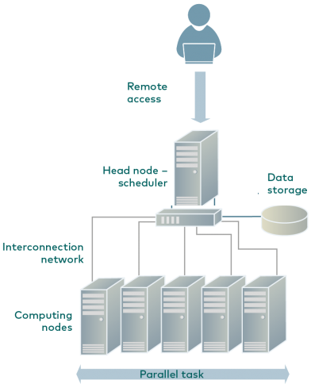

Using H4H
================

## Login

  - First login to UHN VPN service. See details here [UHN
    VPN](www.uhnresearch.ca/news/working-remotely-vpn)
  - Once VPN activated use ssh to login to H4H from terminal. Windows
    users should use [PUTTY](https://www.putty.org) tool as SSH client.

Note that login leads to scheduler node and DO NOT RUN any code on this
node.

``` r
ssh -p 10022 userName@172.27.23.163
```



## Data transfer

Data can be transferred to and from H4H using the scp command. This
command is similar to cp and stands for secure copy-paste.

Send data to H4H:

``` r
scp -P 10022 Local_File_Path userName@172.27.23.163:~/destination_path
```

Get data from H4H:

``` r
scp -P 10022 userName@172.27.23.163:~/file_path Local_File_Path
```

## Interactive session

You can include R code in the document as follows:

``` r
## Node with 1 CPU, for 15 minutes, 2GB of memory
salloc -c 1 -t 0:15:0 --mem 2G 
```

Once in the node, load R as:

``` r
module load R/3.6.1
```

After this you can use Rscript or R interactive session. Type R and see
if it works. Note that once time is over you will be disconnected from
the node and all unsaved data will be gone.

## Installing R packages:

To install packages from internet login to the build partition. It is
the only node with internet access.

``` r
#login to build node
salloc --partition=build -c 1 -t 1:0:0 --mem 2G 

#load R 
module load R/3.6.1

#run R
R

##next try installing R package 
install.packages("vioplot")
install.packages("foreach")
install.packages("doParallel")
```

## Submit job:

First we will submit a simple job that sleeps for 60 seconds. See file
code1.R:

``` r
foo <- function(x)
{
  Sys.sleep(x)
}

t0 <- proc.time()
foo(60)
proc.time() - t0
```

Create a job submission script, save this as **run\_job1.sh** :

``` r
#!/bin/bash

### no. of nodes
#SBATCH --nodes=1

### no. of tasks on the node 
#SBATCH --ntasks-per-node=1

### Memory for each CPU, for number in GB use G
#SBATCH --mem-per-cpu=100M

### Time required for job, HH:MM:SS
#SBATCH --time=0:02:00

### job name and output file names
#SBATCH --job-name=job1
#SBATCH --error=job1.out
#SBATCH --output=job1.out

### load R etc.
source /etc/bashrc
module load R/3.6.1

###change to the dir where code is
cd /cluster/home/$USER/H4H-tutorial/R

###run R code 
Rscript code1.R
```

Submit the job to cluster as:

``` r
sbatch run_job1.sh
```

Check queue status as

``` r
squeue
```

To cancel the job:

``` r
scancel jobID # Cancel a specific job

scancel -u username # Cancel all jobs you have running

scancel -t state # Kill a job based on the state it is in
```

## Running parallel code:

A very simple example of parallel code is in file **code2.R** and
corresponding job submission file is in **run\_job2.sh** . In principle
this is same as running one job, discussed earlier. However make sure
that your ntasks-per-node is same as number of parallel cores in the R
code.
